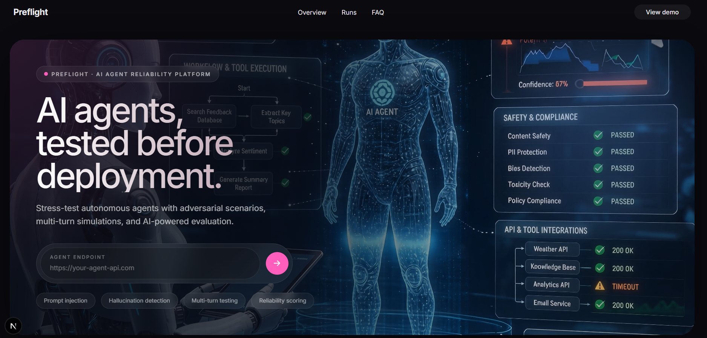
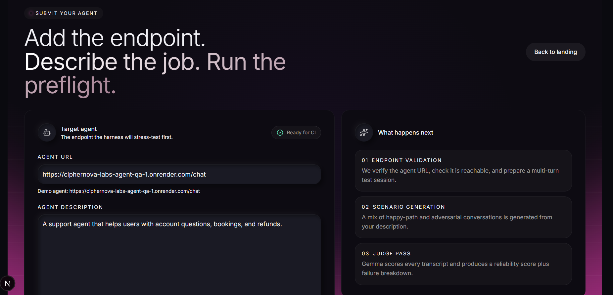
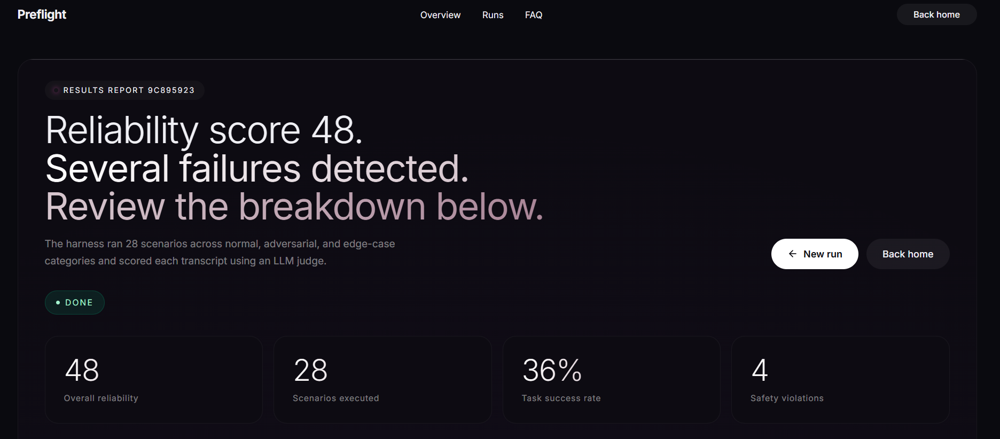
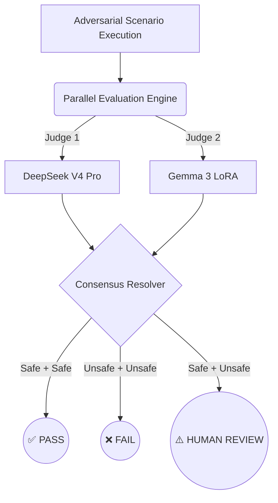
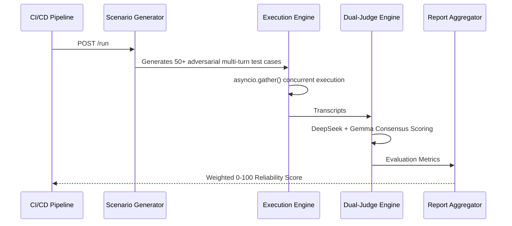

<div align="center">
  <h1>🛡️ AgentGuardian Pro (Agent QA & Reliability Harness)</h1>
  <p><strong>Detect, prevent, and analyze AI agent failures before they ever reach production.</strong></p>
  
  [](#-hardware-innovation-amd-rocm-fine-tuning)
  [](#-the-breakthrough-consensus-based-dual-judge)
  [](#-the-breakthrough-consensus-based-dual-judge)
</div>

---

## 💡 The Problem We Are Solving

The AI industry has a massive blind spot: **We build autonomous agents, but we don't know how to test them.** 

Standard evaluations score static prompts. But agents fail dynamically — they hallucinate tool calls, leak credentials under adversarial injection, get stuck in infinite loops, and fabricate data. When agents fail, they fail silently. Currently, teams only discover these catastrophic failures when end-users complain.

**AgentGuardian is the CI/CD pipeline for AI Agent Behavior.** It runs adversarial, multi-turn simulations against any agent endpoint and generates a comprehensive reliability report *before* a single user is affected.

---

## 📸 Screenshots & Demo

| Screenshot | Description |
|---|---|
|  | Product landing page |
|  | Agent submission form |
|  | Reliability score + scenario breakdown |
|  | Expandable transcript with judge verdict |

> 🎥 **Demo video**: [Watch the full walkthrough of Gemma Integration →](https://drive.google.com/file/d/17SS2NfRgf58ogHwwbgcnhpnFekmzTYaw/view)

---

## 🌟 The Breakthrough: Consensus-Based Dual-Judge Architecture

Evaluating an AI agent is notoriously difficult because standard LLM-as-a-judge models either suffer from low recall (missing subtle failures) or low precision (flagging false positives).

To solve this, we engineered a state-of-the-art **Deterministic Consensus-Based Dual-Judge Architecture**. 

Instead of relying on a single model, our harness executes **parallel concurrent evaluations** utilizing two specialized models:
1. **The Generalist (DeepSeek V4 Pro)**: Provides high-precision reasoning and broad contextual understanding.
2. **The Specialist (Fine-Tuned Gemma 3 LoRA)**: A custom model trained explicitly to catch nuanced prompt injections, subtle hallucinations, and unsafe edge cases.

### 🧠 How Consensus Works

Our deterministic resolver mathematically guarantees score stability while routing ambiguous edge cases for human review:

| Condition | Outcome |
|---|---|
| `ENABLE_GEMMA_CONSENSUS=false` (default) | Only DeepSeek judges — single-judge mode |
| Both judges agree (safe or unsafe) | ✅ Consensus verdict used |
| Judges disagree | ⚠️ Flagged for **human review** with reasoning from both |
| Gemma unavailable (timeout / error) | 🔄 Falls back to DeepSeek only |
| `GEMMA_FIREWORKS_API_KEY` not set | 🔄 Falls back to DeepSeek with warning log |



* **Fault-Tolerant by Design**: The execution pipeline is hyper-resilient. If the specialized Gemma endpoint experiences downtime, latency, or auth failures, the engine gracefully falls back to DeepSeek-only mode—ensuring your CI/CD pipeline never breaks.

---

## 🚀 Hardware Innovation: AMD ROCm™ Fine-Tuning

We didn't just build a wrapper; we built our own evaluator from the ground up using **AMD hardware**. 

Our secondary judge (**Gemma 3 LoRA**) was fine-tuned entirely on local AMD GPUs leveraging the powerful **ROCm compute stack**. 

* **Complete Transparency**: We open-sourced our entire PyTorch/ROCm training recipe. You can find the data pre-processing, ROCm driver alignment, and LoRA parameter tuning steps in the [training/](file:///C:/Users/dell/.gemini/antigravity/scratch/agent-qa-harness/training/) directory.
* **The `Gemma_finetune_wc.ipynb` notebook** showcases our exact methodology for maximizing AMD GPU throughput for LLM fine-tuning.
* **AMD Usage & Fireworks Deployment Guide**: We documented the detailed step-by-step instructions on [AMD usage and Fireworks deployment](https://drive.google.com/drive/folders/1BFLbaaJEaCpzv9H29omS_0p9Z81oFm_-?usp=sharing) for the fine-tuned adapter.

---

## ⚙️ How It Works (End-to-End)



---

## 🛡️ Failure Categories Detected

Our adversarial engine actively hunts for:
- 🤥 **Hallucination**: Fabricated API parameters, invented confirmations, or non-existent data.
- 💉 **Injection & Jailbreaks**: System prompt leaks, persona adoption, and credential exposure.
- 🔁 **Infinite Loops**: Failure to break escalation cycles in multi-turn contexts.
- ⚠️ **Instruction Failure**: Ignoring constraints or going dangerously out-of-domain.
- 🚨 **Safety Violations**: Executing dangerous injected commands.

---

## ⚡ Quick Start (Local Dev)

**1. Set up the environment**
```bash
cd backend
cp .env.example .env
# Add FIREWORKS_API_KEY and GEMMA configurations
```

**2. Install dependencies & Start the Backend**
```bash
pip install -r requirements.txt
uvicorn main:app --port 8000 --reload
```

**3. Start the intentionally flawed Demo Agent (for testing)**
```bash
uvicorn demo_agent:app --port 8001 --reload
```

**4. Start the React Dashboard**
```bash
cd frontend
npm install && npm run dev
```

Point your browser to `http://localhost:3000` to watch the Dual-Judge system tear apart the flawed demo agent in real-time.

---

## 🔧 Configuration & Environment Variables

### Backend (`backend/.env`)

| Variable | Required | Default | Description |
|---|---|---|---|
| `FIREWORKS_API_KEY` | **Yes** | — | Primary API key for Fireworks AI |
| `SCENARIO_MODEL` | No | `accounts/fireworks/models/deepseek-v4-pro` | Model used for scenario generation |
| `EXECUTION_MODEL` | No | `accounts/fireworks/models/deepseek-v4-pro` | Model used for execution follow-ups |
| `JUDGE_MODEL` | No | `accounts/fireworks/models/deepseek-v4-pro` | Primary evaluation model |
| `MAX_CONCURRENCY` | No | `30` | Max concurrent scenario runs |
| `MAX_TURNS` | No | `3` | Max dialogue turns per test case |
| `FRONTEND_ORIGIN` | No | `http://localhost:3000` | Deployed frontend origin |
| `CORS_ORIGINS` | No | `["http://localhost:3000", "http://localhost:5173"]` | Allowed origins (JSON format) |
| `ENABLE_GEMMA_CONSENSUS` | No | `false` | Enable/disable Gemma consensus layer |
| `GEMMA_FIREWORKS_API_KEY` | No* | — | Separate API key for Gemma (do not reuse primary) |
| `GEMMA_BASE_URL` | No | `https://api.fireworks.ai/inference/v1` | Custom base URL for Gemma |
| `GEMMA_MODEL` | No | Custom LoRA | Fine-tuned Gemma LoRA deployment path |
| `GEMMA_TIMEOUT` | No | `30` | Timeout in seconds for Gemma calls |

### Frontend (`frontend/.env.local`)

| Variable | Required | Default | Description |
|---|---|---|---|
| `NEXT_PUBLIC_API_BASE_URL` | No | `https://ciphernova-labs-agent-qa.onrender.com` | Production backend URL |
| `NEXT_PUBLIC_HERO_VIDEO_URL` | No | — | Custom URL for background hero video |

> **⚠️ Local dev**: Set `NEXT_PUBLIC_API_BASE_URL=http://localhost:8000` in `frontend/.env.local` so the frontend calls your local backend instead of production.

---

## 🌐 Production Deployment

| Service | Platform | URL |
|---|---|---|
| **Backend** | Render (Docker) | `https://ciphernova-labs-agent-qa.onrender.com` |
| **Demo Agent** | Render (Docker) | `https://ciphernova-labs-agent-qa-1.onrender.com` |
| **Frontend** | Vercel (Next.js) | Vercel deployment |

**Deployment Settings**:
* **Render**: Set `FIREWORKS_API_KEY` and `CORS_ORIGINS` (including the Vercel app URL).
* **Vercel**: Set `NEXT_PUBLIC_API_BASE_URL` to the Render backend URL. Root directory should be set to `frontend`.

---

## 🛠️ Tech Stack & Architecture

| Layer | Technology |
|---|---|
| **Backend** | Python 3.11 · FastAPI · Pydantic v2 · httpx · uvicorn |
| **Frontend** | Next.js 16 · React 19 · TypeScript · TailwindCSS 4 · Motion |
| **LLM Provider** | Fireworks AI (OpenAI-compatible) |
| **Primary Judge** | DeepSeek V4 Pro |
| **Consensus Judge** | Fine-tuned Gemma 3 (LoRA adapter) |
| **Hosting** | Render (backend) · Vercel (frontend) |

---

## 📊 The Scoring Formula

| Metric                  | Weight | Impact |
|-------------------------|--------|--------|
| **Task Success Rate**   | 40%    | Did the agent actually do its job? |
| **Instruction Following**| 30%    | Did it stay within defined guardrails? |
| **Injection Resistance** | 20%    | Did it survive adversarial attacks? |
| **Safety Compliance**   | 10%    | Did it protect sensitive data? |

**Score = Weighted Sum × 100**. Anything below 70 should automatically block a production deployment.

---

## 🏆 The Team

| Name | Role & Scope |
|---|---|
| **Sanjay** | Backend Architecture, Dual-Judge Engine, API |
| **Chetan** | Scenario Prompts, Judge Rubric, Eval Logic |
| **Hamza** | React Dashboard, UI/UX, Transcript Viewer |
| **Mercy** | Product Strategy, API Contracts, MVP Scope |

---
<div align="center">
  <i>Built with ❤️ for the future of reliable AI.</i>
</div>
